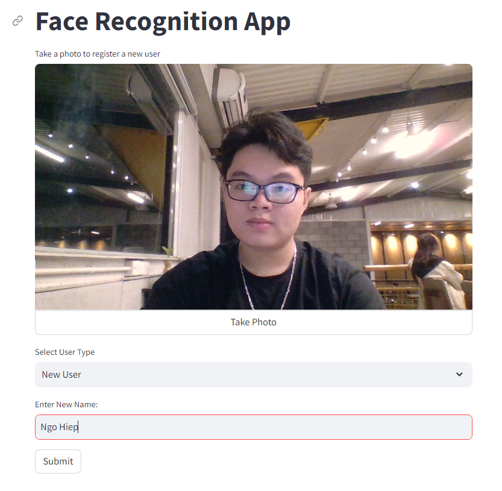
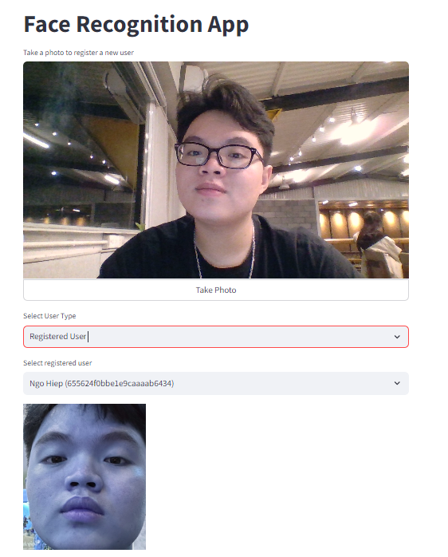
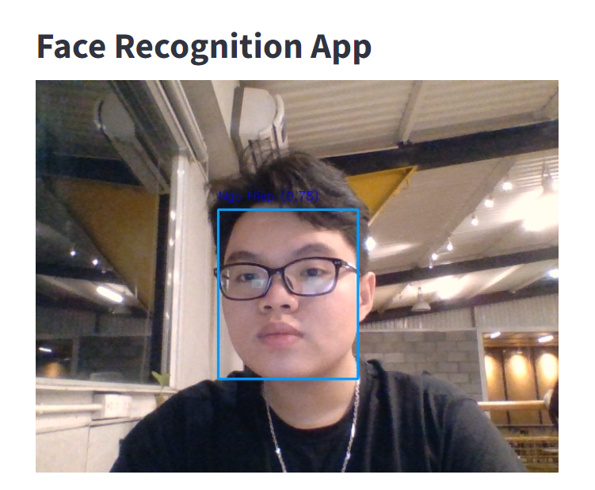

# Face recognition application using ArcFace + ResNet50

## Introduction

This is a face recognition application using ArcFace + ResNet50 based on the [InsightFace](https://github.com/TreB1eN/InsightFace_Pytorch).

Main features:

- Register new faces to the database.
- Add new faces for an existing person.
- Recognize faces in the image snapshots or video stream.

## Installation

Install the required packages using the following command:

```
pip install -r requirements.txt
```

Download the pre-trained model from [IR-SE50 @ BaiduNetdisk](https://pan.baidu.com/s/12BUjjwy1uUTEF9HCx5qvoQ), [IR-SE50 @ Onedrive](https://1drv.ms/u/s!AhMqVPD44cDOhkPsOU2S_HFpY9dC) and put it in the current directory.

Configure the database connection in `config.py`.

Configure vector search indexing on mongodb: [Vector search tutorial mongo atlas](https://www.mongodb.com/developer/products/atlas/building-generative-ai-applications-vector-search-open-source-models/)

## Demo

### Register new faces



### Add a new face for an existing person



### Recognize faces in video stream


